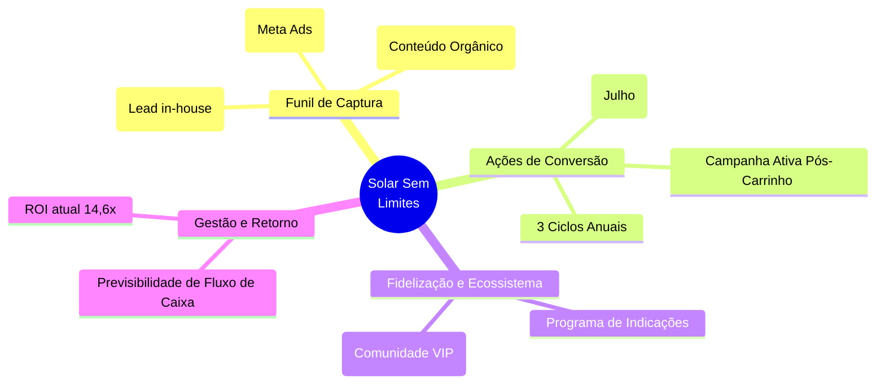

# Planejamento Estratégico de Negócios: Solar Sem Limites

> [!TIP]
> **Bem-vindo ao seu painel estratégico, Geraldo!**
> Este é o documento oficial de planejamento para a transformação do "Solar Sem Limites". Ele é vivo, o que significa que vamos editá-lo e evoluí-lo juntos a cada resposta sua e a cada nova etapa do negócio.

---

## 1. Visão Geral e Posicionamento

*A transição da mentalidade de "Campanha" para "Produto"*

- **O que é:** Programa exclusivo de diárias antecipadas do Hotel Solar. Embalado como o pacote supremo de flexibilidade e economia.
- **Estruturação:** 6 diárias por R$ 2.800 (R$ 467/diária) com 12 meses de validade.
- **Objetivos Centrais (Por que o produto existe):**
  1. Gerar fluxo de caixa maciço e antecipado em momentos estratégicos.
  2. Aumentar a taxa de retorno (fidelização) de hóspedes valiosos.
  3. Criar previsibilidade de ocupação ao longo do ano.
  4. Formar o núcleo da nossa comunidade (Círculo Solar).

---

## 2. Raio-X Financeiro (Nov/2025 – Mar/2026)

Os números mostram uma validação inquestionável do produto.

| Métrica | Nov/2025 (Lançamento) | Mar/2026 (Reabertura) | **Consolidado** |
| :--- | :--- | :--- | :--- |
| **Investimento** | R$ 10.000,00 | R$ 3.248,00 | **R$ 13.248,00** |
| **Pacotes Vendidos** | 52 | 17 | **69 pacotes** |
| **Faturamento** | R$ 145.600,00 | R$ 47.600,00 | **R$ 193.200,00** |
| **ROI** | 14,5x | 14,6x | **14,6x** |
| **CAC (Custo/Cliente)**| R$ 192,00 | R$ 191,00 | **R$ 192,00** |

> [!IMPORTANT]  
> **O Maior Insight:** Na reabertura, ~40% das vendas (7 de 17) vieram *após* o carrinho fechar, sem campanha ativa. Isso denota a **alta intenção de compra** represada na base. O "gargalo", portanto, não é de demanda ou preço, mas estritamente operacional e de timing de fechamento.

---

## 3. Mapa Mental de Escala e Alavancas

---

## 4. Plano de Ação Estratégico (As Alavancas de Crescimento)

O projeto anual visa alcançar **210 pacotes vendidos/ano** (~R$ 588.000 de faturamento em 3 grandes picos).

### Alavanca 1: Máquina de Follow-Up (Pós-Carrinho)
Como vimos que 40% ocorreu espontaneamente, precisamos estruturar isso:
- [ ] Criar "Scripts de Recuperação" para a equipe de WhatsApp usar ativamente em leads engajados que não compraram 2 dias após a campanha.
- [ ] Automatizar mensagens de lembrete com última chance.

### Alavanca 2: Expansão de Base (A Mente de Lançador)
- [ ] Com CAC estabilizado em R$ 192 e ROI de 14,6x, aumentar a injeção inicial de verba para inflar a "Lista VIP" antes no próximo ciclo (Escala Pura).

### Alavanca 3: Interseção com Círculo Solar
- [ ] Convidar, com exclusividade, a base que comprou o pacote para se tornar "Membro Fundador" do Círculo Solar, utilizando gatilho de pertencimento.

### Alavanca 4: O "Offline" como Canal de Aquisição Direta (Julho)
- [ ] O hóspede no hotel (venda in-house) é o lead mais quente. Estruturar material de PDV (displays no quarto/recepção) que vende o passaporte do SSL durante o check-out na alta temporada.

### Alavanca 5: Escala Orgânica (Indicação)
- [ ] Estabelecer Programa de Indicações para a base de clientes do SSL: "Indique um novo comprador e ganhe 1 diária extra (ou jantar no restaurante)".

---

## 5. As Diretrizes de Execução (Roadmap Validado)

Com base em nossa análise situacional conjunta, estabelecemos três novos pilares de execução para sustentar a escala a partir de agora:

### Eixo 1: O Cronograma Oficial de Ciclos
O ano foi mapeado estrategicamente para preencher os *vales de fluxo de caixa* com duas frentes dinâmicas e independentes:
- **Ciclo Master (Novembro + Março):** Focado no Lançamento Oficial em Novembro para o público geral/internet e sua Reabertura Oficial em Março (Modelo atual vitorioso validado).
- **Ciclo In-House (Julho):** Estratégia tática offline. Não mexemos no tarifário público agressivo de Julho. A campanha será exclusiva de *Up-sell interno*, oferecendo o pacote "Solar Sem Limites" (nas mesmas condições campeãs de Novembro) somente para quem **já está hospedado vivenciando o hotel**. O argumento é imbatível: "Garanta a sua volta para o lado de cá pagando preço de custo".

### Eixo 2: Aquecimento e Quebra de Objeções (A Nova Pré-Campanha)
O maior limitador das vendas mapeado no diagnóstico foram as fricções de *forma de pagamento* e a *falta de aquecimento de conteúdo nativo do hotel*.
**Ação prática para os próximos ciclos:**
- **Conteúdo de Antecipação:** 14 a 21 dias antes da abertura de carrinho, estruturaremos uma vitrine mostrando a vivência no Hotel Solar: *tours guiados pela equipe*, *detalhes do café da manhã* e *experiências de quem já usou o SSL* para maximizar o apelo emocional. O pacote precisa ser vendido pela *experiência do destino*, não apenas pelo gatilho financeiro.
- **Engenharia de Check-out:** Integrarmos melhores condições de pagamento. Exemplos: testar múltiplas formas de pagamento (Multibanco/Pix+Cartão) ou expandir as ofertas de parcelamento para driblar clientes que desejam os 6 dias mas estão com o limite do cartão faturado.

### Eixo 3: Modelo de Vendas Híbrido e Testes
Saber que o time aguenta o tranco mantendo a alta conversão nos garante segurança. Hoje, dividimos a carga magistralmente: 50% *self-service* (compra sozinho pelo link) / 50% *high-touch* (WhatsApp via recepção e ligações).
**Ação prática:**
- Manter esse equilíbrio blindando o time com as respostas prontas de FAQ.
- **Laboratório de Automações:** Vamos testar páginas de vendas (Landing Pages) que sejam tão ricas e imersivas (respondendo todas as objeções no topo da página) que elevem o índice *self-service* de 50% para 70%, validando modelos de fechamento mais robustos que exigem menos tempo humano.

### Eixo 4: Ofensiva Offline de Julho (Bombardeio Visual no PDV)
Para a operação fechada de Julho, adotaremos uma estratégia de "Cerco de Experiência" físico, mirando não apenas os hóspedes, mas também o ouro que é o *cliente passante* que consome no restaurante, garantindo que ele não saia do Hotel Solar sem desejar o pacote.
**1. A Esteira de Pontos de Contato:**
- A presença da oferta será agressiva e ubíqua: *Banners em áreas comuns estratégicas*, *Displays imponentes nas mesas do restaurante*, destaque direto no *Cardápio Digital*, e sinalética no *Balcão da Recepção*.
**2. A Dupla Garra de Fechamento:**
- **Silenciosa (QR Code):** Todo material físico terá o link para a nova Landing Page super-otimizada. O cliente se auto-convence durante um drink e já sai bloqueando a fatura do cartão ali mesmo.
- **High-Touch (Check-out):** A recepção adota um "Script de Upsell" protocolar. Ao fechar a conta das férias incríveis, o agente tem o convite formalizado em mãos e tenta a venda do passaporte ali, no auge do êxtase do hóspede.

---

> [!TIP]
> **O Plano de Negócios está Solidificado!**
> A estratégia agora é um produto contínuo mapeado ano a ano. O próximo passo de execução prática, Geraldo, é tirarmos isso do papel para o design e para a tecnologia. Podemos começar escolhendo: **(A)** Revisar os textos persuasivos (copywriting) e a Landing Page de *Julho*, ou **(B)** Planejar a criação gráfica (briefing dos displays, banners) e estruturação de como a recepção vai checar quem passou o cartão. O que prefere atacar primeiro?
