# Planejamento Estratégico de Negócios: Solar Sem Limites

> [!TIP]
> **Bem-vindo ao seu painel estratégico, Geraldo!**
> Este é o documento oficial de planejamento para a transformação do "Solar Sem Limites". Ele é vivo, o que significa que vamos editá-lo e evoluí-lo juntos a cada resposta sua e a cada nova etapa do negócio.

---

## 1. Visão Geral e Posicionamento

*A transição da mentalidade de "Campanha" para "Produto"*

- **O que é:** Programa exclusivo de diárias antecipadas do Hotel Solar. Embalado como o pacote supremo de flexibilidade e economia.
- **Estruturação:** 6 diárias por R$ 2.800 (R$ 467/diária) com 12 meses de validade.
- **Objetivos Centrais (Por que o produto existe):**
  1. Gerar fluxo de caixa maciço e antecipado em momentos estratégicos.
  2. Aumentar a taxa de retorno (fidelização) de hóspedes valiosos.
  3. Criar previsibilidade de ocupação ao longo do ano.
  4. Formar o núcleo da nossa comunidade (Círculo Solar).

---

## 2. Raio-X Financeiro (Nov/2025 – Mar/2026)

Os números mostram uma validação inquestionável do produto.

| Métrica | Nov/2025 (Lançamento) | Mar/2026 (Reabertura) | **Consolidado** |
| :--- | :--- | :--- | :--- |
| **Investimento** | R$ 10.000,00 | R$ 3.248,00 | **R$ 13.248,00** |
| **Pacotes Vendidos** | 52 | 17 | **69 pacotes** |
| **Faturamento** | R$ 145.600,00 | R$ 47.600,00 | **R$ 193.200,00** |
| **ROI** | 14,5x | 14,6x | **14,6x** |
| **CAC (Custo/Cliente)**| R$ 192,00 | R$ 191,00 | **R$ 192,00** |

> [!IMPORTANT]  
> **O Maior Insight:** Na reabertura, ~40% das vendas (7 de 17) vieram *após* o carrinho fechar, sem campanha ativa. Isso denota a **alta intenção de compra** represada na base. O "gargalo", portanto, não é de demanda ou preço, mas estritamente operacional e de timing de fechamento.

---

## 3. Mapa Mental de Escala e Alavancas

```mermaid
mindmap
  root((Solar Sem
  Limites))
    Funil de Captura
      Tráfego Pago (Meta Ads)
      Redes Sociais (Conteúdo Orgânico)
      Wi-Fi do Hotel (Lead in-house)
    Ações de Conversão
      3 Ciclos Anuais
      Campanha Ativa Pós-Carrinho 
      Vendas Ativas no Balcão (Julho)
    Fidelização e Ecossistema
      Círculo Solar (Comunidade VIP)
      Programa de Indicações
    Gestão e Retorno
      ROI atual 14,6x
      Previsibilidade de Fluxo de Caixa
```

---

## 4. Plano de Ação Estratégico (As Alavancas de Crescimento)

O projeto anual visa alcançar **210 pacotes vendidos/ano** (~R$ 588.000 de faturamento em 3 grandes picos).

### Alavanca 1: Máquina de Follow-Up (Pós-Carrinho)
Como vimos que 40% ocorreu espontaneamente, precisamos estruturar isso:
- [ ] Criar "Scripts de Recuperação" para a equipe de WhatsApp usar ativamente em leads engajados que não compraram 2 dias após a campanha.
- [ ] Automatizar mensagens de lembrete com última chance.

### Alavanca 2: Expansão de Base (A Mente de Lançador)
- [ ] Com CAC estabilizado em R$ 192 e ROI de 14,6x, aumentar a injeção inicial de verba para inflar a "Lista VIP" antes no próximo ciclo (Escala Pura).

### Alavanca 3: Interseção com Círculo Solar
- [ ] Convidar, com exclusividade, a base que comprou o pacote para se tornar "Membro Fundador" do Círculo Solar, utilizando gatilho de pertencimento.

### Alavanca 4: O "Offline" como Canal de Aquisição Direta (Julho)
- [ ] O hóspede no hotel (venda in-house) é o lead mais quente. Estruturar material de PDV (displays no quarto/recepção) que vende o passaporte do SSL durante o check-out na alta temporada.

### Alavanca 5: Escala Orgânica (Indicação)
- [ ] Estabelecer Programa de Indicações para a base de clientes do SSL: "Indique um novo comprador e ganhe 1 diária extra (ou jantar no restaurante)".

---

## 5. As Diretrizes de Execução (Roadmap Validado)

Com base em nossa análise situacional conjunta, estabelecemos três novos pilares de execução para sustentar a escala a partir de agora:

### Eixo 1: O Cronograma Oficial de Ciclos
O ano foi mapeado estrategicamente para preencher os *vales de fluxo de caixa* com duas frentes dinâmicas e independentes:
- **Ciclo Master (Novembro + Março - Lançamento Aberto):** Focado no Lançamento Massivo para o público geral/internet (Visando os +10.000 Leads). *Atenção ao Setup Tecnológico Exclusivo:* Diferente do In-House restrito (onde as pessoas já estão hospedadas e o tom é concierge), a campanha de Novembro exigirá uma etapa de desenvolvimento completamente nova: criação de uma **Nova Landing Page (MainLP)** com gatilhos intensos e sem contato com recepção, novas **Páginas de Captura VIP** para o cadastro dos 10K leads, e a produção de um **Novo Roteiro ManyChat de Lançamento de Massa** para reaquecer os leads frios da Meta Ads. Este é um esforço de desenvolvimento do "zero" e compõe grande parte da rodada final do ano.
- **Ciclo In-House (Julho):** Estratégia tática offline. Não mexemos no tarifário público agressivo de Julho. A campanha será exclusiva de *Up-sell interno*, oferecendo o pacote "Solar Sem Limites" (nas mesmas condições campeãs de Novembro) somente para quem **já está hospedado vivenciando o hotel**. O argumento é imbatível: "Garanta a sua volta para o lado de cá pagando preço de custo".

### Eixo 2: Aquecimento e Quebra de Objeções (A Nova Pré-Campanha)
O maior limitador das vendas mapeado no diagnóstico foram as fricções de *forma de pagamento* e a *falta de aquecimento de conteúdo nativo do hotel*.
**Ações práticas para os próximos ciclos:**
- **Captação Perpétua (Oceano Azul de Leads e Automação):** Implementar geração ativa de cadastros na Lista VIP do Solar de forma contínua e antecipada puxando tráfego do Meta Ads com custo reduzido. A meta é escalar para **10.000 Leads** capturados antes de Novembro/2026. O motor mecânico será regido por três passos táticos fundamentais criados na infraestrutura:
  1. **A Isca Meta Ads (O Gatilho Oculto):** Tráfego contínuo focado não em venda, mas em benefício estético (Conteúdos da Lancha, Café colonial, Destinos inexplorados da Orla) contendo apenas o convite para entrar na Lista de Convidados e ganhar o Voucher Cortesia de 10%.
  2. **A Fechadura (Landing Page Limpa):** Uma página de captura independente exigindo preenchimento restrito de Nome, E-mail e WhatsApp para liberação.
  3. **A Tríplice Aliança Tecnológica:** A submissão injeta em 1 segundo: O cliente entra na Automação Mensal Oficial Hoteleira da **Brevo**; O cliente é empurrado simultaneamente ao WhatsApp do hotel com o Bot **ManyChat** entregando a cortesia prometida; Um Ping algorítmico do Pixel ensina imediatamente a **Meta Ads** a capturar "clones" demográficos perfeitos com esse último ticket.
- **Conteúdo de Antecipação (Aqueceimento Base Meta):** 14 a 21 dias antes da abertura de carrinho do Solar Sem Limites de Novembro/26, engatilhar disparos de novidades por e-mail e Zap na "Lista Perpétua" (gerada na ação acima) contendo as vitrines imersivas: *tours guiados do hotel*, *café da manhã impecável*, elevando a consciência para fecharem o Funil de Vendas Quente na abertura.
- **Engenharia de Check-out (✅ Status Pronto):** O funil de fricção financeira já foi driblado com a integração do Checkout Multibanco Híbrido (Pix + Cartão).

### Eixo 3: Modelo de Vendas Híbrido e Testes
Saber que o time aguenta o tranco mantendo a alta conversão nos garante segurança. Hoje, dividimos a carga magistralmente: 50% *self-service* (compra sozinho pelo link) / 50% *high-touch* (WhatsApp via recepção e ligações).
**Ação prática:**
- Manter esse equilíbrio blindando o time com as respostas prontas de FAQ.
- **Laboratório de Automações:** Vamos testar páginas de vendas (Landing Pages) que sejam tão ricas e imersivas (respondendo todas as objeções no topo da página) que elevem o índice *self-service* de 50% para 70%, validando modelos de fechamento mais robustos que exigem menos tempo humano.

### Eixo 4: Ofensiva Offline de Julho (Bombardeio Visual no PDV)
Para a operação fechada de Julho, adotaremos uma estratégia de "Cerco de Experiência" físico, mirando não apenas os hóspedes, mas também o ouro que é o *cliente passante* que consome no restaurante, garantindo que ele não saia do Hotel Solar sem desejar o pacote.
**1. A Esteira de Pontos de Contato:**
- A presença da oferta será agressiva e ubíqua: *Banners em áreas comuns estratégicas*, *Displays imponentes nas mesas do restaurante*, destaque direto no *Cardápio Digital*, e sinalética no *Balcão da Recepção*.
**2. O Funil Híbrido In-House (A Tripla Garra de Fechamento):**
O fluxo do material físico (via QR Code) não vai direto para o site. Ele passará pela nossa máquina de retenção do ManyChat para garantirmos a captura do contato. Essa abordagem estratégica possui três pontas de lance complementares:
- **Silenciosa/Imediata:** O cliente escaneia o QR Code nas mesas e cai no WhatsApp (Captura do Lead assegurada). O robô imediatamente passa a oferta básica e envia o link da **Landing Page**. O hóspede pode comprar ali mesmo, num ambiente 100% self-service imersivo.
- **Nutrição de Hospedagem (Gotejamento Diário no WhatsApp):** Se o cliente não comprar na hora H, o ManyChat engatilha o funil: dispara *uma mensagem diária* durante o restante de sua estadia. Cada pílula resolve uma dor e quebra objeções (Garantia risco zero, depoimentos provando a economia, matemática invertida clara), aquecendo-o aos poucos sem incomodar.
- **High-Touch (Check-out):** A recepção amarra as pontas finais com um "Script de Upsell" protocolar. Se o hóspede leu as vantagens via WhatsApp a estadia toda e foi reaquecido, o agente da recepção possui um cenário de conversão absurdamente mais fácil durante o check-out.

---

> [!TIP]
> **O Plano de Negócios está Solidificado!**
> A estratégia híbrida agora torna o projeto uma tática contínua e madura. Com o código da Landing Page In-House e do Checkout Pix+Cartão finalizados no projeto, os nossos mais certeiros próximos passos práticos de execução (100% fáceis e diretos agora) são:
>
> 1. Desenhar a **Régua Prática do Funil ManyChat** (Rascunhar as 3-4 mensagens exatas da nutrição diária durante a hospedagem).
> 2. Planejar as **peças de Design Offline** para impressão do QR Code que vai disparar as mesas e áreas de lazer do Hotel.
